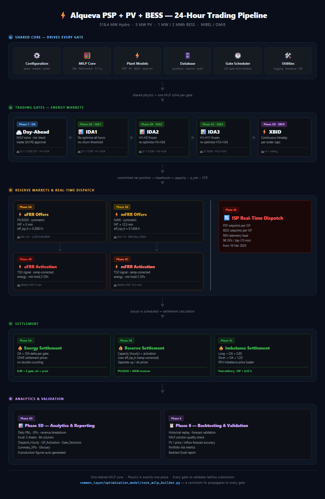

# Alqueva PSP + PV + BESS — 24-Hour Energy Trading Optimizer

<p align="center">
  
  
  
  
  
</p>

<p align="center">
  <b>Production-grade 24-hour MILP trading optimizer for the Alqueva hybrid energy plant (Portugal / MIBEL)</b><br/>
  Pumped-Storage Hydro · Floating PV · Battery Storage · DA / IDA / XBID / aFRR / mFRR · Full Settlement & Analytics
</p>

---

## Pipeline Architecture

<p align="center">
  
</p>

<details>
<summary>Text diagram (Mermaid)</summary>

```mermaid
flowchart TD
    subgraph C0["① Shared Core — drives every gate"]
        direction LR
        cfg["⚙️ Configuration"] --- milp["🧮 MILP Core"] --- phy["⚡ Plant Models"] --- db["🗄️ Database"] --- sched["🕐 Gate Scheduler"] --- util["🛠️ Utilities"]
    end

    subgraph G0["② Trading Gates — one MILP solve per gate"]
        direction LR
        DA["**Phase 1 · DA**<br/>H1–H24<br/>D-1 12:00 CET"]
        --> IDA1["**Phase 2A · IDA1**<br/>H1–H24<br/>D-1 15:00 CET"]
        --> IDA2["**Phase 2B · IDA2**<br/>H3–H24<br/>D-1 22:00 CET"]
        --> IDA3["**Phase 2C · IDA3**<br/>H12–H24<br/>D 10:00 CET"]
        --> XBID["**Phase 2D · XBID**<br/>open hours<br/>H-1 rolling"]
    end

    P3A["**Phase 3A · aFRR**<br/>PICASSO · FAT 5 min<br/>eff_h = 0.2083"]
    P4B["**Phase 4B · aFRR Activation**<br/>TSO signals"]
    P3B["**Phase 3B · mFRR**<br/>MARI · FAT 12.5 min<br/>eff_h = 0.1458"]
    P4C["**Phase 4C · mFRR Activation**<br/>TSO signals"]
    RT["**Phase 4A · ISP Real-Time Dispatch**<br/>PSP & BESS setpoints · 96 ISPs/day · REN telemetry"]

    subgraph S0["④ Settlement"]
        direction LR
        S5A["**Phase 5A**<br/>Energy Settlement<br/>DA + IDA delta · OMIE"] &
        S5B["**Phase 5B**<br/>Reserve Settlement<br/>capacity + act · eff_isp_h"] &
        S5C["**Phase 5C**<br/>Imbalance Settlement<br/>Long×0.85 · Short×1.20 · REN"]
    end

    subgraph A0["⑤ Analytics & Validation"]
        direction LR
        A5D["**Phase 5D · Analytics & Reporting**<br/>P&L · KPIs · Excel 5 sheets · 94 cols · 9 figures"] &
        A6["**Phase 6 · Backtesting**<br/>Historical replay · forecast validation<br/>MILP quality check · portfolio risk"]
    end

    C0 --> G0
    G0 --> P3A & P3B & RT
    P3A --> P4B
    P3B --> P4C
    P4B & P4C & RT --> S0
    S0 --> A0
```

> **Key:** each gate freezes committed hours and re-optimises the remaining window with updated prices. Reserve headroom = plant capacity − committed p_net − FCR. Settlement uses ramp-corrected effective ISP hours (eff_isp_h).

</details>

---

## Plant

| Asset | Specification | Status |
|-------|--------------|--------|
| **PSP** | 4 × reversible Francis units — 129.6 MW turbine / 111.6 MW pump each → **518.4 MW gen / 446.4 MW pump** | Confirmed / pump estimated |
| **PV** | 5 MWp floating solar array (commissioned 2022) | Confirmed |
| **BESS** | 1 MW / 2 MWh · SOC 10 %–95 % · η_c = η_d = 0.90 | Confirmed |
| **Upper reservoir** | Alqueva — 3,150 Mm³ usable · head range 54.7–73.0 m | Confirmed |
| **Lower reservoir** | Pedrógão — 54 Mm³ usable (binding constraint on long pumping sequences) | Confirmed |

> **Sign convention everywhere:** generation / discharge = **+** · pumping / charging = **−**

---

## Market Coverage

| Gate | Exchange | Closes (CET) | Scope | Entry Point |
|------|----------|-------------|-------|-------------|
| **DA** | OMIE | D-1 12:00 | All 24 hours | `phase_1_da_day_ahead_bidding/run_da.py` |
| **IDA1** | OMIE SIDC | D-1 15:00 | H1–H24 | `phase_2a_ida1_intraday_auction_1/run_ida1.py` |
| **IDA2** | OMIE SIDC | D-1 22:00 | H3–H24 | `phase_2b_ida2_intraday_auction_2/run_ida2.py` |
| **IDA3** | OMIE SIDC | D 10:00 | H12–H24 (H1–H11 frozen) | `phase_2c_ida3_intraday_auction_3/run_ida3.py` |
| **XBID** | SIDC continuous | H-1 rolling | Open hours only | `phase_2d_xbid_continuous_intraday/run_xbid.py` |
| **aFRR** | PICASSO | DA + 1 h | Symmetric up/dn · FAT = 5 min | `phase_3a_afrr_automatic_frequency_reserve/run_afrr.py` |
| **mFRR** | MARI | DA + 1 h | Symmetric up/dn · FAT = 12.5 min | `phase_3b_mfrr_manual_frequency_reserve/run_mfrr.py` |
| **Imbalance** | REN | Post-delivery | Long → DA×0.85 · Short → DA×1.20 | `phase_5c_imbalance_settlement/run_imbalance_settlement.py` |

**Key regulatory dates encoded in `config/market.yaml`:**
- SIDC reform: 6 → 3 intraday auctions from **13 Jun 2024**
- ISP: 15-minute (96/day) from **19 Mar 2025**
- aFRR (PICASSO) harmonised: **4 Dec 2024** · cap ≤ 250 EUR/MW (REN)
- mFRR (MARI): REN joined **27 Nov 2024**
- FCR: mandatory & non-remunerated in PT/ES — modelled as reserved headroom, never a market gate

---

## Quick Start

```bash
# Install dependencies
pip install -r requirements.txt

# Run full pipeline for tomorrow (AUTO mode, synthetic prices)
python run_production.py

# Run for a specific date
python run_production.py --date 2026-06-28

# Backtest mode (fully automated, no live APIs)
python run_production.py --date 2026-06-28 --auto --synthetic

# Resume from a specific phase (if an earlier run crashed)
python run_production.py --date 2026-06-28 --from-phase realtime

# Run only selected phases
python run_production.py --date 2026-06-28 --only da,afrr,mfrr

# Validate config and imports without executing
python run_production.py --dry-run
```

**Solver:** CPLEX 22.1 preferred. Falls back automatically to HiGHS (free, bundled via `highspy`) → CBC. The pipeline runs on any machine without a CPLEX licence.

---

## MILP Core

One model drives **every gate** — DA, IDA1, IDA2, IDA3, XBID all solve the same 24-hour MILP (`common_layer/optimisation_model/core_milp_builder.py`). Gates differ only in price/forecast inputs and which hours are frozen to the already-committed position. A constraint fix propagates automatically to every gate.

**Decision variables (per hour `h`, unit `u`):**

| Variable | Description |
|----------|-------------|
| `p_turb[u,h]` / `p_pump[u,h]` | Turbine / pump power MW (non-negative magnitude) |
| `on_turb[u,h]` / `on_pump[u,h]` | Mode binaries (PR-1: mutually exclusive) |
| `H_net[h]` | Dynamic hydraulic head (m) — linear in reservoir volume |
| `omega_trb[u,fi,hi,h]` / `omega_pmp[u,fi,hi,h]` | 5×5 efficiency surface interpolation weights |
| `pv_used[h]` / `pv_to_bess[h]` / `pv_curt[h]` | PV disposition (sum = PV forecast) |
| `p_chg[h]` / `p_dis[h]` / `soc[h]` | BESS charge / discharge / state of charge |
| `v_up[h]` / `v_low[h]` | Upper / lower reservoir volumes (hm³) |
| `p_net[h]` | Net grid injection = bid quantity (MWh) |

**Key constraints:**
- **McCormick linearisation** of bilinear `H_net × on_binary` — 4 envelope constraints per unit per mode per hour
- **5×5 efficiency surface** for Francis units: η = f(flow\_normalised, head\_normalised), clipped [0.85, 0.92]
- **Head model:** `H_net = 54.7 + 7.89e-9 × (v_up_m³ − 830e6)` m, range 54.7–73.0 m
- **Net power identity:** `p_net = PSP_net + pv_used + p_dis − p_chg` (pv_to_bess is internal)
- **No double-selling (PR-11):** headroom = capacity − committed p_net − FCR reserved

---

## Phase Reference

| Phase | Module | Entry Point | Description |
|-------|--------|------------|-------------|
| **Phase 1** | `phase_1_da_day_ahead_bidding/` | `run_da.py` | DA MILP solve → risk check → trader approval → position save |
| **Phase 2A** | `phase_2a_ida1_intraday_auction_1/` | `run_ida1.py` | Re-optimise H1–H24 · no-churn threshold · SIDC delta bids |
| **Phase 2B** | `phase_2b_ida2_intraday_auction_2/` | `run_ida2.py` | H1–H2 frozen · re-optimise H3–H24 |
| **Phase 2C** | `phase_2c_ida3_intraday_auction_3/` | `run_ida3.py` | H1–H11 frozen · re-optimise H12–H24 |
| **Phase 2D** | `phase_2d_xbid_continuous_intraday/` | `run_xbid.py` | Continuous intraday · per-order caps · H-1 rolling |
| **Phase 3A** | `phase_3a_afrr_automatic_frequency_reserve/` | `run_afrr.py` | aFRR capacity offers · PICASSO · FAT 5 min · eff_isp_h = 0.2083 h |
| **Phase 3B** | `phase_3b_mfrr_manual_frequency_reserve/` | `run_mfrr.py` | mFRR capacity offers · MARI · FAT 12.5 min · eff_isp_h = 0.1458 h |
| **Phase 4A** | `phase_4a_isp_real_time_dispatch/` | `run_realtime.py` | 96 ISPs/day · PSP + BESS setpoints · REN telemetry |
| **Phase 4B** | `phase_4b_afrr_activation_response/` | `run_afrr_activation.py` | TSO activation signal · ramp-corrected energy · min hold 2 ISPs |
| **Phase 4C** | `phase_4c_mfrr_activation_response/` | `run_mfrr_activation.py` | TSO activation signal · ramp-corrected energy · min hold 3 ISPs |
| **Phase 5A** | `phase_5a_da_ida_settlement/` | `run_energy_settlement.py` | DA + IDA delta per gate · OMIE prices · no double-counting |
| **Phase 5B** | `phase_5b_reserve_settlement/` | `run_reserve_settlement.py` | Capacity (hourly) + activation · eff_isp_h ramp-corrected · PICASSO + MARI |
| **Phase 5C** | `phase_5c_imbalance_settlement/` | `run_imbalance_settlement.py` | Long→DA×0.85 · Short→DA×1.20 · REN imbalance prices |
| **Phase 5D** | `phase_5d_analytics_and_reporting/` | `run_analytics.py` | Daily P&L · KPIs · Excel (5 sheets) · 9 production figures |
| **Phase 6** | `phase_6_backtesting_and_validation/` | `run_backtest.py` | Historical replay · forecast validation · MILP quality check · portfolio risk |

---

## Shared Core (`common_layer/`)

### Optimisation Model

| Module | Class / Function | Description |
|--------|-----------------|-------------|
| `core_milp_builder.py` | `CoreModelMeta`, `build_milp()` | Shared 24h MILP — one model for all gates |
| `core_milp_solver.py` | `solve_milp()`, `SolveError` | CPLEX-first auto-select · raises `SolveError` if infeasible (PR-13) |
| `ida_reoptimiser.py` | `optimise_ida()` | Freeze committed hours · re-solve with updated prices |
| `reserve_offer_builder.py` | `build_afrr_offers()`, `build_mfrr_offers()` | Headroom left after committed energy (no double-selling, PR-11) |
| `activation_ramp_tracker.py` | — | Ramp-corrected effective ISP hours for reserve settlement |

### Physical Plant Models

| Module | Class | Description |
|--------|-------|-------------|
| `psp_turbine_pump_model.py` | `PSPModel`, `UnitDispatch` | 4 reversible Francis units · mode exclusivity (PR-1) · min stable load (PR-2) |
| `pv_production_model.py` | `PVModel` | 5 MWp floating PV · temperature derate · annual degradation |
| `bess_model.py` | `BESSModel`, `BESSDispatch` | 1 MW / 2 MWh · SOC bounds (PR-7) · no simultaneous charge/discharge (PR-8) · FAT deliverability |
| `reservoir_model.py` | `ReservoirModel` | Two-reservoir closed-loop water balance · spill · volume bounds |
| `fcr_headroom_model.py` | `FCRHeadroomModel` | FCR reserved headroom — never sold to any market |
| `reservoir_activation_checker.py` | `ReservoirActivationChecker` | Validates long-pumping sequences against lower reservoir |

### Database Stores

All stores write to `runtime/` — the directory is created on first run.

| Class | File | Database | Description |
|-------|------|----------|-------------|
| `PositionStore` | `position_store.py` | `runtime/db/positions.db` | Committed market positions per gate (FR-1.4 / INV-8) |
| `ReserveStore` | `reserve_store.py` | `runtime/db/reserve.db` | Reserve capacity offers — aFRR and mFRR |
| `DeliveryStore` | `realtime_store.py` | `runtime/db/realtime.db` | Per-ISP scheduled vs actual net power |
| `ActivationStore` | `realtime_store.py` | `runtime/db/realtime.db` | Per-ISP aFRR / mFRR activated energy (up / dn MW) |
| `ComponentStore` | `component_store.py` | `runtime/components/components_<date>.json` | Per-component DA dispatch (PSP / BESS / PV / reservoir) |
| `AuditStore` | `audit_store.py` | `runtime/audit/audit_YYYY-MM-DD.jsonl` | Read-only query of append-only audit trail |

### Configuration (`config/`)

| File | Description |
|------|-------------|
| `config/market.yaml` | Gate times · IDA regime dates · ISP duration · FAT values · bid price limits · balancing penalties |
| `config/plant.yaml` | PSP / PV / BESS / reservoir specs · head model · efficiency surface · timezone |
| `config/solver.yaml` | Solver order (CPLEX → HiGHS → CBC) · MIP gap · per-gate time limits · threads |
| `config/run.yaml` | Delivery date · mode (trader / auto) · data source (synthetic / live) · phase enable flags |

Loaded via `common_layer/configuration/config_loader.py` → `AppConfig` dataclass (aggregates `PlantConfig`, `MarketConfig`, `SolverConfig`).

### Utilities

| Module | Class / Function | Description |
|--------|-----------------|-------------|
| `audit_logger.py` | `AuditLogger` | Append-only JSONL audit trail — one record per event (FR-1.5 / INV-8) |
| `timezone_utils.py` | — | CET (market / OMIE) ↔ WET/CET (plant / Portugal) conversions |
| `date_utils.py` | — | Delivery date parsing · D-1 calculations |
| `logging_utils.py` | — | Standard logger setup with phase-prefixed names |
| `gate_scheduler/gate_scheduler.py` | `GateScheduler` | CET gate-time resolver · triggers for DA / IDA1 / IDA2 / IDA3 / XBID |

---

## Output Figures

All 9 figures are auto-generated by `figures/` and saved to `figures/output/` at 600 DPI.

| Figure | Function | Description |
|--------|----------|-------------|
| `fig01_dispatch_profile.png` | `_fig01()` | DA net position (MWh) + DA price (EUR/MWh) bar + line |
| `fig02_soc_trajectory.png` | `_fig02()` | BESS SoC (% of 2 MWh capacity) · 10 %/95 % bounds · step plot |
| `fig03_revenue_waterfall.png` | `_fig03()` | Revenue by stream — DA · IDA+XBID · aFRR · mFRR · Imbalance — stacked bar |
| `fig04_reserve_capacity.png` | `_fig04()` | aFRR + mFRR capacity offered (MW up/dn per hour) · dual subplots |
| `fig05_gate_position_comparison.png` | `_fig05()` | Position evolution: DA → IDA1 → IDA2 → IDA3 → XBID line plot |
| `fig06_intraday_reoptimisation.png` | `_fig06()` | DA vs final committed position · IDA+XBID delta bar overlay |
| `fig07_psp_dispatch.png` | `_fig07()` | PSP turbine / pump MW schedule vs DA price · bar + line |
| `fig08_pv_bess_flow.png` | `_fig08()` | PV disposition (used / to-BESS / curtailed) + BESS power · dual subplots |
| `ops_board.png` | `_ops_board()` | 3×3 operations dashboard: dispatch · SoC · KPIs · position evolution · aFRR · mFRR · P&L |

---

## Excel Report

Generated by `phase_5d_analytics_and_reporting/daily_excel_reports/daily_report_exporter.py`.  
Output: `runtime/reports/daily_report_<date>.xlsx`

| Sheet | Columns | Description |
|-------|---------|-------------|
| **Dispatch_Hourly** | 94 | Hour-by-hour dispatch for all assets: PSP units, BESS, PV, reservoir, head, positions |
| **ISP_Activation** | — | Per-ISP (15 min) aFRR / mFRR activation records with ramp-corrected energy |
| **Gate_Decisions** | — | DA → IDA1 → IDA2 → IDA3 → XBID position evolution and P&L per gate |
| **Summary_KPIs** | — | 10 KPI sections: revenue, dispatch, reserves, imbalance, solver quality, risk metrics |
| **Glossary** | — | Variable definitions, units, and spec references |

---

## Project Structure

```
Alqueva-PSP-PV-BESS-24hr-Energy-Trading-DA-IDA-aFRR-mFRR-Optimizer/
│
├── run_production.py                    # Master orchestrator — runs all 15 phases
│
├── common_layer/                        # Shared foundation for every phase
│   ├── configuration/                   # AppConfig / PlantConfig / MarketConfig / SolverConfig
│   ├── optimisation_model/              # Shared 24h MILP, IDA re-optimiser, reserve builder
│   ├── physical_plant_models/           # PSP / PV / BESS / reservoir / FCR physics
│   ├── database/                        # PositionStore / ReserveStore / DeliveryStore / AuditStore
│   ├── gate_scheduler/                  # CET gate-time resolver and trigger
│   └── utilities/                       # Logging / timezone / ISP calendar / audit logger
│
├── phase_1_da_day_ahead_bidding/        # Phase 1  — DA
├── phase_2a_ida1_intraday_auction_1/    # Phase 2A — IDA1
├── phase_2b_ida2_intraday_auction_2/    # Phase 2B — IDA2
├── phase_2c_ida3_intraday_auction_3/    # Phase 2C — IDA3
├── phase_2d_xbid_continuous_intraday/   # Phase 2D — XBID
├── phase_3a_afrr_automatic_frequency_reserve/  # Phase 3A — aFRR offers
├── phase_3b_mfrr_manual_frequency_reserve/     # Phase 3B — mFRR offers
├── phase_4a_isp_real_time_dispatch/     # Phase 4A — Real-time ISP dispatch
├── phase_4b_afrr_activation_response/   # Phase 4B — aFRR activation
├── phase_4c_mfrr_activation_response/   # Phase 4C — mFRR activation
├── phase_5a_da_ida_settlement/          # Phase 5A — Energy settlement
├── phase_5b_reserve_settlement/         # Phase 5B — Reserve settlement
├── phase_5c_imbalance_settlement/       # Phase 5C — Imbalance settlement
├── phase_5d_analytics_and_reporting/    # Phase 5D — P&L, KPIs, Excel, 9 figures
├── phase_6_backtesting_and_validation/  # Phase 6  — Backtesting & validation
│
├── figures/                             # 9 production figure generators (Matplotlib)
├── config/                              # market.yaml / plant.yaml / solver.yaml / run.yaml
├── tests/                               # pytest suite — e2e, physics, settlement, reserve
├── runtime/                             # Auto-created: DB files, Excel reports, audit logs
└── docs/                                # Pipeline architecture diagram (PNG + SVG)
```

---

## Dependencies

```
pyomo>=6.7       # Optimisation modelling layer (solver-agnostic)
highspy>=1.7     # Free HiGHS MILP solver — automatic fallback when CPLEX absent
numpy>=1.26      # Numerics
pandas>=2.2      # Data handling
PyYAML>=6.0      # Config files
openpyxl>=3.1    # Excel report export
requests>=2.31   # Live OMIE / REN data loaders (live mode only)
```

**Standard library used:** `sqlite3`, `zoneinfo`, `dataclasses`, `datetime`, `json`, `pathlib`

**Solver setup:** CPLEX 22.1 is called as an external executable via Pyomo — no Python binding needed. Install IBM CPLEX separately and set the path in `config/solver.yaml`. Without CPLEX, the pipeline auto-selects HiGHS (free, no setup required).

---

## Runtime Output Layout

```
runtime/
├── db/
│   ├── positions.db         # SQLite — energy positions (DA, IDA1-3, XBID)
│   ├── reserve.db           # SQLite — reserve offers (aFRR, mFRR)
│   └── realtime.db          # SQLite — per-ISP delivery actuals & activations
├── audit/
│   └── audit_YYYY-MM-DD.jsonl   # Append-only audit trail (one JSON record per event)
├── components/
│   └── components_YYYY-MM-DD.json  # Per-component DA dispatch results
└── reports/
    └── daily_report_YYYY-MM-DD.xlsx  # 5-sheet Excel report
```

---

## Design Principles

- **One MILP model, all gates** — physics and constraints live in `core_milp_builder.py`; gates differ only in inputs and frozen hours. A constraint fix propagates everywhere automatically.
- **No double-selling** (PR-11) — `reserve_offer_builder.py` always subtracts committed energy position before computing reserve headroom.
- **Audit trail on every action** — `AuditLogger` writes a JSONL record for every solve, position save, approval, and submission. `AuditStore` provides read-only query access.
- **Physical validation before submission** — each phase runs a physical checker (mode exclusivity, SOC bounds, reservoir bounds, FAT deliverability) and raises before any market call on violation.
- **Timezone-correct everywhere** — all gate times in CET (Madrid), all plant timestamps in WET/CET (Lisbon). `timezone_utils.py` handles DST transitions.
- **Solver resilience** — CPLEX → HiGHS → CBC fallback chain; `SolveError` raised if no feasible solution within the per-gate time limit.
- **Fully restartable** — `--from-phase` flag allows recovering any run from any phase without re-running earlier phases.
